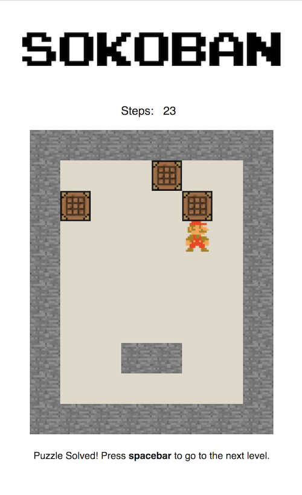
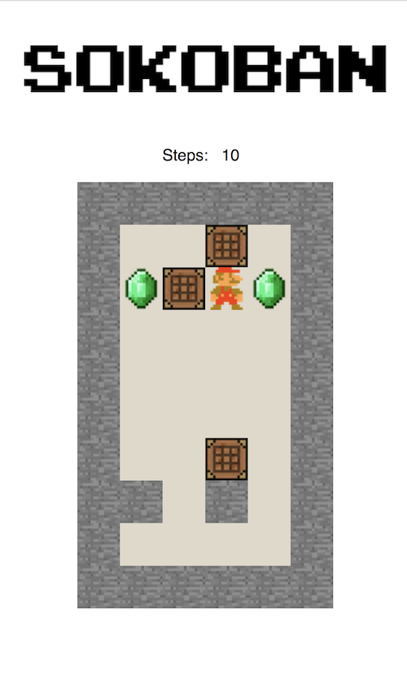

# Sokoban

Project made with academic purposes for the programming lecture of the course M.Sc. Interactive Digital Media
at Trinity College Dublin to demonstrate my knowledges in programming fundamentals.

